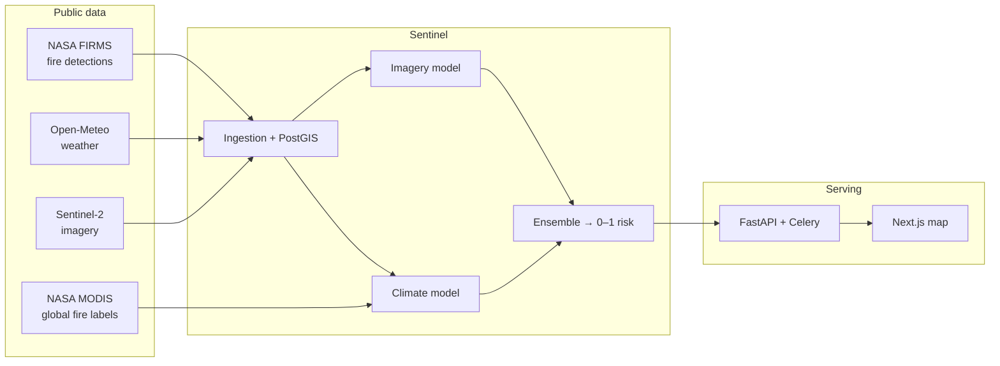

<div align="center">

# Sentinel

### Wildfire risk forecasting engine

**Predicts wildfire ignition risk anywhere on Earth from live satellite and climate
data, and serves calibrated risk scores on a real-time interactive map.**

[](https://github.com/Blasted-ctrl/Sentinel/actions/workflows/ci.yml)


</div>

---

## What it does

Wildfires move fast, and the gap between ignition and uncontrollable spread is
short. Sentinel turns public earth-observation data into a calibrated **0–1
ignition-risk score** for any region or point on the planet — learned from real
fire records, not hand-coded heuristics — and serves it through a live map you can
query anywhere.

- **Global.** Click anywhere on the map to score that exact location on demand, or
  browse pre-scored fire-prone regions across every continent.
- **Real models, honest metrics.** Two deep-learning models — one on satellite
  imagery, one on multi-year climate sequences — are fused into a single score.
  Every number below is read from a committed `metrics.json`, measured on
  geospatially held-out regions with no location leakage.
- **Production-shaped.** Geospatial database, streaming ingestion, a typed API,
  scheduled re-scoring, and a polished dashboard.

## Architecture



## Tech stack

| Layer | Tools |
| --- | --- |
| Models | PyTorch, TensorFlow / Keras, scikit-learn |
| Backend | FastAPI, Celery, SQLAlchemy 2.0, GeoAlchemy2 |
| Data | PostgreSQL + PostGIS, Redis, S3 / MinIO |
| Frontend | Next.js + TypeScript, Leaflet |
| Tooling | uv, ruff, mypy, pytest, Docker, GitHub Actions |

## Model performance

> Read straight from committed `metrics.json` files, evaluated on **geospatially
> held-out** regions (never seen in training — no region leakage), all RNG seeded.

**Satellite-imagery model** — classifies tiles as fire / no-fire (ResNet-18
transfer learning, 402 grid-cell regions, held-out test set):

| Recall | Precision | F1 | ROC-AUC | False-alarm |
| --- | --- | --- | --- | --- |
| **0.989** | 0.863 | 0.922 | 0.981 | 0.161 |

**Climate model (global)** — predicts ignition within 7 days from a 14-day weather
sequence, trained on **200 fire-active regions worldwide** (test regions span
multiple continents), labelled by NASA MODIS global active fire:

| ROC-AUC | Recall | Precision | F1 | False-alarm |
| --- | --- | --- | --- | --- |
| **0.85** | 0.85 | 0.86 | 0.85 | 0.33 |

**Ensemble** — a logistic meta-model fuses the two signals, scored on 29 held-out
global regions:

| Variant | ROC-AUC | Recall | False-alarm |
| --- | --- | --- | --- |
| Climate only | 0.854 | 0.847 | 0.335 |
| **Ensemble** | 0.826 | 0.805 | **0.287** |
| Imagery only | 0.620 | 0.168 | 0.065 |

The climate signal dominates; the imagery model contributes a noisy global prior
that the meta-model down-weights, trading a little ranking AUC for a meaningfully
**lower false-alarm rate (0.287 vs 0.335)**. Reported straight — nothing tuned for
the README.

## Run it locally

```bash
# 1 — infrastructure
docker compose up -d db redis                      # PostGIS + Redis

# 2 — API
cd backend
uv sync --extra dev --extra torch --extra tf       # provisions Python 3.12 + deps
uv run sentinel init-db                            # enable PostGIS + create tables
uv run sentinel seed-demo --score                  # seed + score global regions
uv run uvicorn sentinel.api.app:app --port 8000    # http://localhost:8000/docs

# 3 — dashboard
cd ../frontend
pnpm install
echo "NEXT_PUBLIC_API_URL=http://localhost:8000" > .env.local
pnpm dev                                            # http://localhost:3000
```

Models are produced by the `sentinel` CLI (`train-cnn`, `train-lstm-global`,
`build-ensemble`); each writes its metrics to `metrics/`. Data comes from NASA
FIRMS / MODIS, Open-Meteo, and Sentinel-2 (all public; a free Kaggle token is used
for the labelled training sets).

## API

```bash
docker compose up -d        # db, redis, minio, api, worker, beat
```

| Endpoint | Description |
| --- | --- |
| `GET /health` | liveness + version |
| `GET /risk/point?lat=&lon=&date=` | score **any point on Earth** on demand |
| `GET /risk/geojson` | regions + latest scores (feeds the map) |
| `GET /risk?region=<id\|name>&date=` | a tracked region's score |
| `GET /risk/latest` | latest score per region |

The web process stays lightweight — it serves scores that a **Celery** worker
computes and stores in PostGIS, re-scoring every tracked region daily.

## Deploy

The serving model weights (`backend/metrics/**`) ship with the repo via **Git
LFS**, so both platforms build self-contained — no separate artifact hosting.
Render and Vercel fetch LFS objects on checkout automatically.

**Backend → Render** ([`render.yaml`](render.yaml))

1. Render Dashboard → **New → Blueprint** → point at this repo. The blueprint
   provisions PostGIS, Redis, the API (Docker), and the Celery worker/beat.
2. On the `sentinel-api` service, set `CORS_ORIGINS` to your Vercel URL.
3. After the first deploy, open the API service's **Shell** and seed the DB once
   (this is what populates the map):

   ```bash
   sentinel init-db              # enable PostGIS + create tables
   sentinel seed-demo --score    # seed + score global regions
   ```

   Scoring loads PyTorch + TensorFlow, so the worker runs on a paid plan; bump the
   API plan too if you want on-demand `/risk/point` scoring under load.

**Frontend → Vercel**

1. Import the repo; set the **root directory** to `frontend/`. Next.js is auto-detected.
2. Add `NEXT_PUBLIC_API_URL` = your Render API URL (e.g. `https://sentinel-api.onrender.com`).
3. Redeploy if you added the env var after the first build.

`docker-compose.yml` runs the whole stack locally in one command.

## Security

- **No secrets in code** — config comes from `.env`; only `.env.example` is committed.
- **Input validation** on every boundary (coordinates, dates, Pydantic settings).
- **No SQL-injection surface** — parameterized SQLAlchemy ORM throughout.
- **Hardened containers** — non-root images, pinned lockfiles (`uv.lock`, `pnpm-lock.yaml`).
- **Restricted CORS** and read-only public endpoints.

## License

MIT
